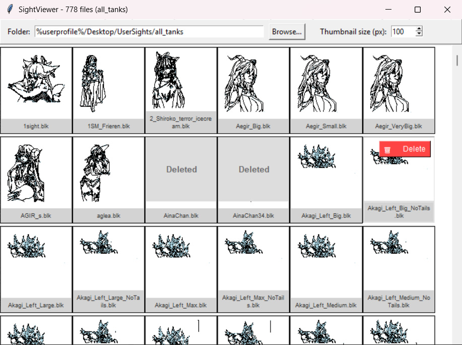

# SightViewer for War Thunder

Очень простое приложение для просмотра и управления файлами sight (.blk) из War Thunder.

## Возможности

- 📁 **Выбор папки** — загрузка всех файлов .blk из выбранной папки
- 🎨 **Отрисовка прицелов** — визуализация прицелов как изображений на основе данных из файлов
- 📐 **Регулируемая сетка** — сетка Tkinter с настраиваемым размером миниатюр
- 🗑️ **Удаление файлов** — перемещение файлов в корзину при клике на иконку корзины

<!-- Превью интерфейса -->



## Установка

```bash
# Клонируйте или скачайте репозиторий
cd git clone https://github.com/BiG-ZO/SightViewer.git

# Установить зависимости
pip install send2trash Pillow
```

## Использование

```bash
# Запустите приложение
python Main.py.pyw
#Либо используйте не требующий установки пайтона .exe 
.\WithoutPythonInstallation\Run.exe
```

### Инструкции

1. **Загрузите папку с файлами**
   - Нажмите кнопку "Browse..."
   - Выберите папку с файлами .blk (например, `C:\Users\%userprofile%\Documents\My Games\WarThunder\Saves\53423873\production\UserSights\all_tanks`)

2. **Просмотрите прицелы**
   - Приложение автоматически загрузит и отобразит все файлы .blk в виде сетки

3. **Предпросмотр**
   - Кликните на изображение прицела для увеличенного просмотра и повторно для закрытия

4. **Удалите файлы**
   - Наведите мышь на изображение прицела
   - Нажмите иконку корзины (🗑️)
   - Файл будет перемещен в корзину Windows

5. **Изменяйте размер миниатюр**
   - Используйте поле "Thumbnail size (px):" для регулировки размера
   - Сетка автоматически перерисуется
 
## Недостатки
   - При наличии большого количества файлов лучше не менять размер окна пока не будут отрисованные все миниатюры, иначе может произойти зависание интерфейса до момента отрисовки всех миниатюр
   - Нет поддержки кругов и треугольников
   - Нет поддержки drag&drop

## Функции

### Основные функции парсинга

- `extract_section()` — извлечение блока из .blk файла
- `parse_draw_lines()` — парсинг линий для отрисовки
- `parse_draw_quads()` — парсинг четырехугольников
- `convert_coordinates()` — преобразование координат для Canvas

### Функции GUI

- `render_sight_to_image()` — отрисовка прицела в PIL Image
- `load_sight_files()` — загрузка файлов из папки
- `refresh_grid()` — обновление сетки изображений
- `delete_file_to_trash()` — удаление файла в корзину


